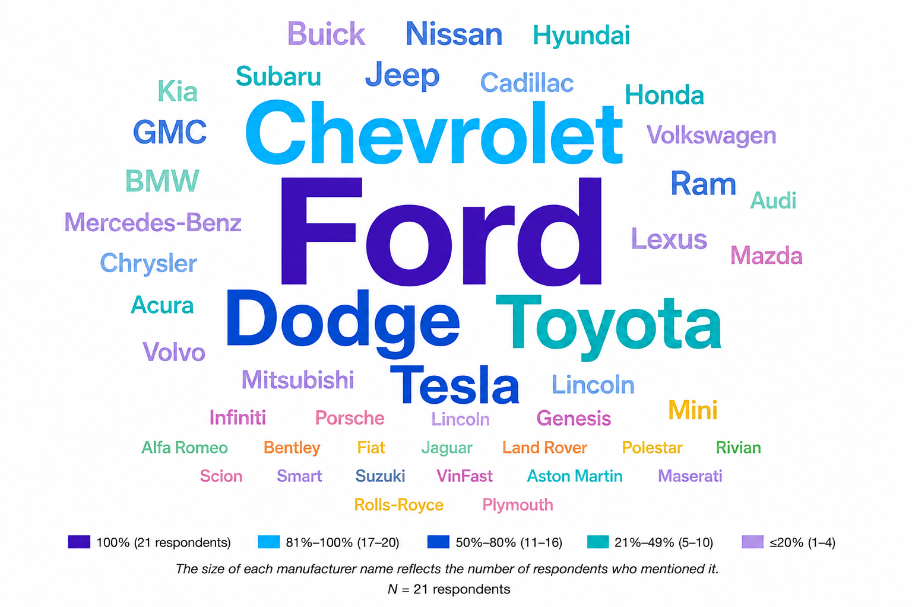
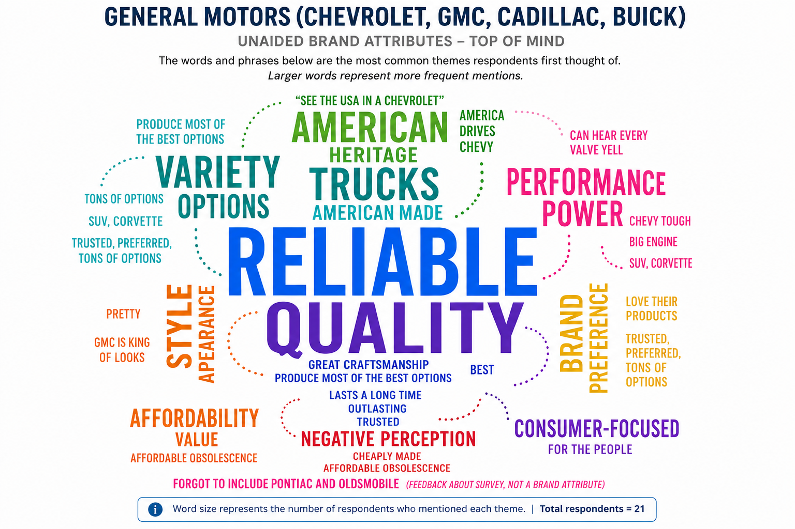

# GM Brand Perception Research
Marketing research study analyzing consumer awareness, perceptions, and brand attributes for General Motors and key automotive competitors.

---

## 📊 Project Overview

This project examines consumer perceptions of General Motors (GM) and compares the company with two key automotive competitors, Ford and Tesla. The research focused on brand awareness, consumer associations, competitive positioning, and perceptions of important vehicle and brand attributes.

A survey was designed and administered using Qualtrics to collect both quantitative and qualitative consumer feedback. The study incorporated unaided and aided awareness measures, open-ended brand perception questions, 5-point rating scales, purchase consideration, and demographic information. Survey results were then analyzed and visualized to identify differences in how consumers perceived GM, Ford, and Tesla.

The analysis was used to identify GM’s perceived strengths, areas of competitive opportunity, and differences among consumer segments. Findings were translated into business-focused recommendations related to GM’s reputation, vehicle variety, value, environmental responsibility, innovation, and technology positioning.

---

## 🎯 Research Objectives

The research was designed to evaluate GM’s position relative to Ford and Tesla by examining several areas of consumer perception. The primary objectives were to:

* Measure aided and unaided brand awareness for GM and competing automotive brands.
* Identify the characteristics and associations consumers connect with GM, Ford, and Tesla.
* Compare perceptions of key brand attributes, including reliability, quality, value, innovation, technology, safety, vehicle variety, environmental responsibility, and reputation.
* Evaluate purchase consideration for GM relative to Ford and Tesla.
* Explore whether perceptions of GM differed across consumer segments.
* Translate the findings into actionable marketing recommendations based on GM’s perceived strengths and competitive opportunities.

---

## 🔬 Research Methodology

The survey was created and administered using Qualtrics and collected both quantitative and qualitative responses. Questions included open-ended responses, familiarity ratings, 5-point agreement scales, purchase consideration, and demographic information.

The survey received 22 responses, with one incomplete response removed from the analysis. This resulted in a final sample of 21 usable responses. Participants were recruited through social media and personal contacts, resulting in a convenience sample.

The original research plan proposed a stratified random sample of 1,067 participants, which would have provided a ±3% margin of error at the 95% confidence level. Because the final sample was much smaller, the actual margin of error was approximately ±21.5%. The results were therefore treated as exploratory and were not intended to represent the entire U.S. new-vehicle market.

Survey responses were analyzed using percentages, mean scores, medians, standard deviations, variance, and comparisons across brands and consumer segments. Open-ended responses were also grouped into common themes to identify the characteristics and ideas participants most often associated with each brand.

---

## 📈 Key Findings & Visualizations

### Brand Awareness

GM showed strong awareness among participants, although **Ford had the highest unaided awareness**, with all 21 respondents mentioning the manufacturer. Chevrolet was also mentioned by nearly all participants, while Dodge, Toyota, and Tesla were among the other brands that stood out most often.

When participants were asked to rate their familiarity with the three companies, **General Motors received the highest mean familiarity score at 3.71**, followed by Ford at 3.43 and Tesla at 1.95. Overall, participants were much more familiar with GM and Ford than with Tesla.

---

### Unaided Brand Perceptions

Open-ended responses were used to better understand what participants naturally associated with each brand. For General Motors, the **strongest themes centered around reliability and quality**, with additional associations related to American heritage, vehicle variety, performance, and style.

The responses showed that perceptions of GM were generally positive, although they were not completely consistent. Some participants also mentioned concerns related to quality and value. Grouping the individual responses into common themes helped show which characteristics were most strongly connected with GM without relying only on prompted rating questions.

---

